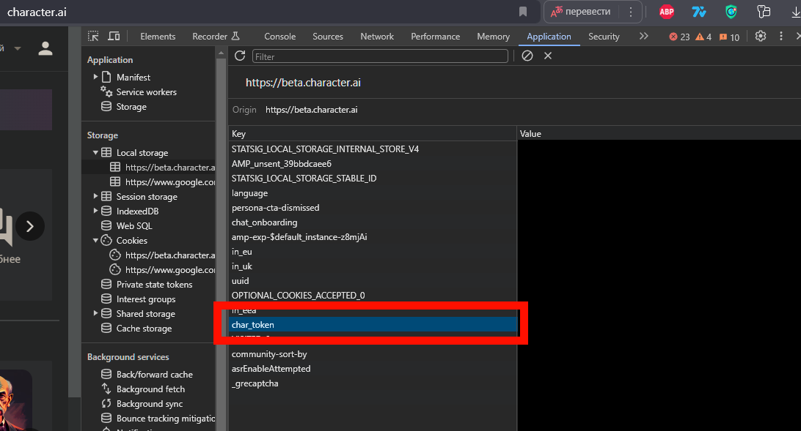

# Discord Tools

Инструменты для работы с Discord, функции чат-ботов, генерация изображений, модерация текста, поиск в интернете, базы данных, перевод, таймеры.

1. [Установка](#section-1)
2. [ChatGPT](#section-2)
    1. [Создание класса](#section-2.1)
    2. [С ключами OPEN_AI](#section-2.2)
    3. [С аутентификационным ключом ChatGPT (бесплатно)](#section-2.3)
    4. [С аутентификационным ключом character.ai (бесплатно)](#section-2.4)
    5. [Ответ](#section-2.5)
    6. [Несколько ответов](#section-2.6)
    7. [Сохранение истории](#section-2.7)
    8. [С системным запросом](#section-2.8)
    9. [Поиск в интернете с GPT](#section-2.9)
    10. [Поиск c ключом Google (РЕКОМЕНДОВАНО)](#section-2.10)
    11. [Ограничить использование ключа OPEN_AI](#section-2.11)
    12. [Модерация](#section-2.12)
3. [Character.ai](#section-3)
    1. [Модерация мата](#section-3.1)
4. [Инструменты для модерации](#section-4)
5. [Бесплатная генерация изображений](#section-5)
    1. [С указанием ключей](#section-5.1)
6. [Цветные логи](#section-6)
7. [Таймеры](#section-7)
8. [Авторизация Discord](#section-8)
9. [Перевод](#section-9)
10. [База данных](#section-10)
11. [Скачать аудиофайл по ссылке с ютуба](#section-11)
12. [Отделить вокал/иструментал](#section-12)
    1. [Одна модель](#section-12.1)
    2. [Несколько моделей](#section-12.2)

## Установка <a name="section-1"></a>

Установите пакет с помощью pip:

```bash
pip install git+https://github.com/Badim41/tools.git
```

# ChatGPT <a name="section-2"></a>
## Создание класса <a name="section-2.1"></a>
```python
from discord_tools.chat_gpt import ChatGPT
chat_gpt = ChatGPT()
```
### С ключами OPEN_AI  <a name="section-2.2"></a>
```python
chat_gpt = ChatGPT(OPEN_AI_KEY: [str, list])
```
### С аутентификационным ключом ChatGPT (бесплатно)  <a name="section-2.3"></a>
```python
# https://chat.openai.com/api/auth/session - {accessToken}
chat_gpt = ChatGPT(auth_keys=AUTH_KEY: [str, list])
```
### С аутентификационным ключом character.ai (бесплатно)  <a name="section-2.4"></a>

```python
# https://beta.character.ai - На F12 смотрите char_token в Local Storage
chat_gpt = ChatGPT(char_tokens=CHAR_TOKEN: [str, list])
```

### С аутентификационным ключом deepseek (бесплатно)  <a name="section-2.4.1"></a>
```python
# https://chat.deepseek.com - На F12 смотрите Authorization в любом запросе к сайту
chat_gpt = ChatGPT(deep_seek_auth_keys=DEEP_SEEK_AUTH_KEYS: [str, list])
```

### С ключом deepseek (бесплатно)  <a name="section-2.4.2"></a>
```python
# https://platform.deepseek.com/api_keys
chat_gpt = ChatGPT(deep_seek_keys=DEEP_SEEK_API_KEYS: [str, list])
```

### Все сразу
```python
chat_gpt = ChatGPT(OPEN_AI_KEY: [str, list],
                   AUTH_KEY: [str, list],
                   CHAR_TOKEN: [str, list])
```
## Ответ  <a name="section-2.5"></a>
```python
result = await chat_gpt.run_all_gpt("запрос")
print(result)
```
### Несколько ответов  <a name="section-2.6"></a>
```python
from discord_tools.chat_gpt import ChatGPT, ChatGPT_Mode
result = await chat_gpt.run_all_gpt("запрос", mode=ChatGPT_Mode.all)
print(result)
```
### Сохранение истории  <a name="section-2.7"></a>
```python
from discord_tools.chat_gpt import 
result = await chat_gpt.run_all_gpt("запрос", user_id=123) # 123 - номер для сохранения
print(result)
await clear_history(123) # отчистка
```
### С системным запросом  <a name="section-2.8"></a>
```python
result = await chat_gpt.run_all_gpt("запрос", gpt_role="Ты полезный ассистент")
print(result)
```
## Поиск в интернете с GPT  <a name="section-2.9"></a>
```python
internet = Internet(chat_gpt)
result = await internet_searcher.search("Погода в Москве сейчас")
```
### Поиск c ключом Google (РЕКОМЕНДОВАНО)  <a name="section-2.10"></a>
```python
API_SEARCH_KEY, CSE_ID - https://docs.typingmind.com/plugins/use-web-search-and-image-search
internet = Internet(chat_gpt, api_search_key=API_SEARCH_KEY, cse_id=CSE_ID)
result = await internet.search("Погода в Москве сейчас")
```
## Ограничить использование ключа OPEN_AI  <a name="section-2.11"></a>
```python
result = await chat_gpt.run_all_gpt("запрос", limited=True)
print(result)

internet = Internet(chat_gpt, limited=True)
result = await internet.search("запрос")
print(result)
```
## Модерация  <a name="section-2.12"></a>
```python
flagged_status, violated_categories = await chat_gpt.moderation_request(text)
if flagged_status:
    print("Нарушенные категории:", violated_categories)
```
# Character.ai  <a name="section-3"></a>
```python
from discord_tools.character_ai_chat import Character_AI
character = Character_AI(char_id, char_token)
result = await character.get_answer("запрос")
print(result)
```
## Модерация мата <a name="section-3.1"></a>
```python
from discord_tools.character_ai_chat import Character_AI, ModerateParams
character = Character_AI(char_id, char_token)
result = await character.get_answer("запрос", moderate_answer=ModerateParams.replace_mat)
print(result)
ModerateParams.skip - не модерировать
ModerateParams.until_good - генерировать до ответа, который пройдёт модерацию
ModerateParams.replace_mat - заменить все нежелательные слова на "^_^"
```
# Инструменты для модерации  <a name="section-4"></a>
```python
from discord_tools.detect_mat import moderate_mat_in_sentence
sentence = "пошёл &*:+@ !"
found_mats, sentence = await moderate_mat_in_sentence(sentence)
if found_mats:
    print("Найдены нежелательные слова, изменённое предложение:", sentence)
```
# Бесплатная генерация изображений <a name="section-5"></a>
```python
from discord_tools.image_generate import GenerateImages
generator = GenerateImages()
images = await generator.generate("Tree 4K")
print(images) # пути к файлам
```
## С указанием ключей <a name="section-5.1"></a>
```python
KANDINSKY_KEYS - https://fusionbrain.ai/keys/
CHAR_TOKENS - https://beta.character.ai - На F12 смотрите char_token в Local Storage

generator = GenerateImages(SECRET_KEYS_KANDINSKY: [str, list], APIS_KANDINSKY: [str, list], CHAR_TOKENS: [str, list])
images = await generator.generate("Tree 4K")
print(images) # пути к файлам
```
# Цветные логи <a name="section-6"></a>
```python
from discord_tools.logs import Logs, Color
logger = Logs(warnings=True)
logger.logging("hello", "world", color=Color.GRAY)
```
# Таймеры <a name="section-7"></a>
```python
from discord_tools.timer import Time_Count
timer = Time_Count()
time.sleep(1)
spent_time = timer.count_time()
print("прошло", spent_time)
```
# Авторизация Discord: просмотр и написание сообщений <a name="section-8"></a>
```python
from discord_tool.discord_auth import Discord_User
ds_user = Discord_User("Username", login=LOGIN, password=PASSWORD)
message = await get_new_chat_message() # получение последнего сообщения
await ds_user.write("Привет!", mension=message) # ответ на сообщение
await set_reaction(message, "👋") # поставить реакцию
```
# Перевод <a name="section-9"></a>
```python
from discord_tools.translate import translate_text, Languages
text = "Привет!"
translated_text = await translate_text(text, Languages.en)
print(translated_text)
```
# База данных <a name="section-10"></a>
```python
from discord_tools.sql_db import get_database, set_database
asyncio.run(set_database(section="Секция", key="Ключ", value="Значение"))
print(get_database(section="Секция", key="Ключ"))
```
```python
# Одним методом (Возможно, что не совсем удобная)*
from discord_tools.sql_db import set_get_database_async
asyncio.run(set_get_database_async(section="Секция", key="Ключ", value="Значение"))
key = asyncio.run(set_get_database_async("Секция", "Ключ"))
print(key)
```
# Скачать аудиофайл по ссылке с ютуба <a name="section-11"></a>
```python
from discord_tools.yt_downloader import get_youtube_video_id, yt_download

url = "https://youtube.com/..."
song_id = get_youtube_video_id(url)

if song_id is None:
    raise Exception("Нет song id")

song_link = song_id.split('&')[0]
audio_path = yt_download(song_link, max_duration=3600) # время в секундах
```

# Отделить вокал/иструментал (и ещё 9 моделей) <a name="section-12"></a>
## Одна модель <a name="section-12.1"></a>
```python
from discord_tools.lalalai import LalalAIModes, process_file_pipeline

file_path = "file.mp3"
result_1, result_2 = process_file_pipeline(large_file_name=file_path,
                                           mode=LalalAIModes.Vocal_and_Instrumental)
```
## Несколько моделей <a name="section-12.2"></a>
```python
from discord_tools.lalalai import full_process_file_pipeline, LalalAIModes

input_str = input("Введите имя файла или ссылку на ютуб:\n")
results = full_process_file_pipeline(input_str,
                                     modes=[LalalAIModes.Vocal_and_Instrumental,
                                            LalalAIModes.Drums,
                                            LalalAIModes.Bass,
                                            LalalAIModes.Electric_guitar,
                                            LalalAIModes.Acoustic_guitar,
                                            LalalAIModes.Piano,
                                            LalalAIModes.Synthesizer,
                                            LalalAIModes.Strings,
                                            LalalAIModes.Wind])
print("All results:", results)
```
